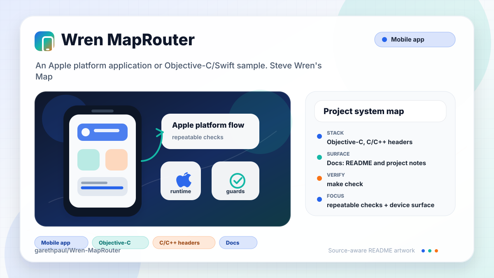
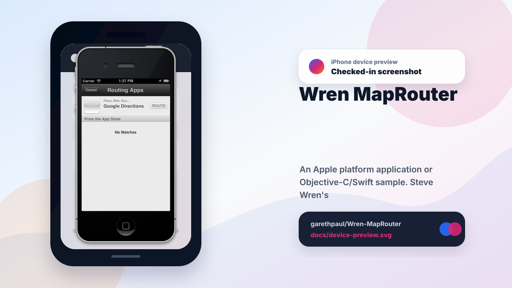

# Wren-MapRouter

<!-- README-OVERVIEW-IMAGE -->


## Device Preview

<!-- DEVICE-PREVIEW-IMAGE -->


## Overview

`garethpaul/Wren-MapRouter` is an Apple platform application or Objective-C/Swift sample. Steve Wren's Map Router

This README is based on the checked-in source, manifests, scripts, and repository metadata on the `master` branch. The project language mix found during review was: Objective-C (2), C/C++ headers (1).

## Repository Contents

- `README.md` - project overview and local usage notes
- `GoogleTransit` - source or example code
- `GoogleTransit.xcodeproj` - Xcode project file
- `SECURITY.md` - security reporting and disclosure guidance
- `VISION.md` - project direction and maintenance guardrails

Additional scan context:

- Source directories: GoogleTransit
- Dependency and build manifests: none detected
- Entry points or build surfaces: GoogleTransit.xcodeproj
- Test-looking files: no obvious test files detected

## Getting Started

### Prerequisites

- Git
- macOS with Xcode for building Apple platform projects

### Setup

```bash
git clone https://github.com/garethpaul/Wren-MapRouter.git
cd Wren-MapRouter
```

The setup commands above are derived from repository files. Legacy mobile, Python, or JavaScript samples may require older SDKs or package versions than a modern workstation uses by default.

## Running or Using the Project

- Open `GoogleTransit.xcodeproj` in Xcode, choose the app or sample scheme, and run it on the matching simulator/device.

## Testing and Verification

- `/usr/bin/make check` - runs dependency-free static contracts, Make authority regression tests, focused mutations, and optional Xcode build/XCTest gates when `/usr/bin/xcodebuild` is available
- GitHub Actions runs the portable gate on Python 3.10, 3.12, and 3.14 with
  fixed Ubuntu 24.04 runners, read-only permissions, superseded-run
  cancellation, and manual dispatch. A macOS gate also builds the iOS 13+
  target and runs the native XCTest policy suite on an available simulator.
  Checkout credentials are not persisted after source retrieval.
- `/usr/bin/make verify` - checks Maps directions registration, location permission
  metadata, GeoJSON validity, route parsing guards, transit modes, and external
  URL forwarding host/path allowlists, route endpoint encoding, query delimiter
  escaping, cleanup on encoding failure, and incomplete non-location route
  cleanup, empty and whitespace-only endpoint rejection, plus transient invalid
  location-sample rejection, negative horizontal-accuracy rejection, and
  cached-location freshness rejection, and transient Core Location error
  preservation
- Completed maintenance plans live under `docs/plans` and are checked by
  `/usr/bin/make check`.
- Xcode's test action or `xcodebuild test` with the appropriate scheme and destination

Repository verification intentionally uses `/usr/bin/make`, anchors default
tools to literal values, and freezes tool/destination selections before later
makefiles can replace them. Its checked-in recipes keep root, recipe
replacement, execution-mode, and derived-data cleanup under the repository
boundary, so build and test cleanup stays contained under `.build/` and
caller-provided derived-data paths are ignored.

That boundary is not a sandbox for caller-supplied Make programs. Target-
specific `override SHELL`/`.SHELLFLAGS`, startup parse-time code from
`MAKEFILES` or extra `-f` inputs, and the default `PYTHON=python3` lookup
through caller `PATH` remain caller authority. Use a trusted `PATH` or an
explicit literal `PYTHON=/path/to/python3` for local verification.

When the required SDK or runtime is unavailable, use static checks and source review first, then verify on a machine that has the matching platform toolchain.

## Configuration and Secrets

- No required secret or credential file was identified in the repository scan. If you add integrations later, keep secrets out of git.
- The app uses current location only to resolve a Maps directions endpoint that explicitly uses Current Location. Do not add route or location persistence without a privacy plan.
- Source, destination, and any resolved current-location coordinate are sent to
  `https://maps.google.com/maps` when the app forwards the transit route. The
  app does not retain those values after forwarding or cancellation.
- Future-dated and older-than-60-second cached locations are ignored while the
  router waits for a fresh coordinate.
- Missing, invalid-coordinate, and negative-accuracy samples are ignored
  without abandoning the pending route or stopping location updates.
- `kCLErrorLocationUnknown` keeps the pending Current Location route active so
  Core Location can deliver a later coordinate; other delegate failures clear
  route state and stop updates.
- Route endpoints are trimmed before encoding so whitespace-only endpoints are
  not forwarded to external maps.

## Security and Privacy Notes

- Review changes touching network requests, sockets, or service endpoints; examples from the scan include GoogleTransit/AppDelegate.m, GoogleTransit/GoogleTransit-Info.plist.
- Review changes touching mobile permissions or privacy-sensitive device data; examples from the scan include GoogleTransit/AppDelegate.m.
- Review changes touching file, media, JSON, XML, CSV, OCR, or data parsing; examples from the scan include GoogleTransit/GoogleTransit-Info.plist.

## Maintenance Notes

- This looks like an Apple platform project or sample. Xcode, Swift, CocoaPods, and deployment target versions may need to match the original project era.
- See `SECURITY.md` for vulnerability reporting and safe research guidance.
- See `VISION.md` for project direction and contribution guardrails.
- See `docs/plans/2026-06-08-maprouter-location-url-contracts.md` for the
  current location and URL-routing baseline.
- See `docs/plans/2026-06-08-maprouter-transit-mode-scope.md` for the declared
  transit-mode scope.
- See `docs/plans/2026-06-08-maprouter-external-url-allowlist.md` for the
  Google Maps forwarding allowlist.
- See `docs/plans/2026-06-09-maprouter-route-endpoint-encoding.md` for route
  endpoint encoding before external forwarding.
- See `docs/plans/2026-06-09-maprouter-empty-endpoint-guard.md` for empty route
  endpoint rejection before external forwarding.
- See `docs/plans/2026-06-09-maprouter-query-delimiter-encoding.md` for
  delimiter-safe query encoding of route endpoints.
- See `docs/plans/2026-06-09-maprouter-external-path-allowlist.md` for the
  Google Maps `/maps` path allowlist.
- See `docs/plans/2026-06-09-maprouter-encoding-failure-cleanup.md` for route
  cleanup when endpoint encoding fails.
- See `docs/plans/2026-06-09-maprouter-incomplete-route-cleanup.md` for route
  cleanup when a non-location route cannot resolve both endpoints.
- See `docs/plans/2026-06-09-maprouter-location-update-validation.md` for
  the original no-location and invalid-coordinate validation boundary.
- See `docs/plans/2026-06-09-maprouter-whitespace-endpoint-guard.md` for
  trimming route endpoints before empty checks and external URL forwarding.
- See `docs/plans/2026-06-10-maprouter-hosted-static-verification.md` for the
  pinned, least-privilege hosted contract baseline.
- See `docs/plans/2026-06-10-maprouter-location-freshness.md` for cached
  location rejection and root-independent verification.
- See `docs/plans/2026-06-10-maprouter-horizontal-accuracy-validation.md` for
  rejecting Core Location samples whose coordinates are marked invalid.
- See `docs/plans/2026-06-13-maprouter-transient-location-errors.md` for
  preserving pending routes across temporary location acquisition failures.
- See `docs/plans/2026-06-13-maprouter-background-route-cleanup.md` for
  preserving routes during temporary inactive states and clearing on
  background entry.
- See `docs/plans/2026-06-13-maprouter-transient-location-samples.md` for
  preserving pending routes while Core Location emits unusable samples.
- See `docs/plans/2026-06-21-maprouter-make-authority-isolation.md` for the
  trusted Make boundary and derived-data cleanup containment.

## Contributing

Keep changes small and tied to the project that is already present in this repository. For code changes, document the toolchain used, avoid committing generated dependency directories or local configuration, and update this README when setup or verification steps change.
